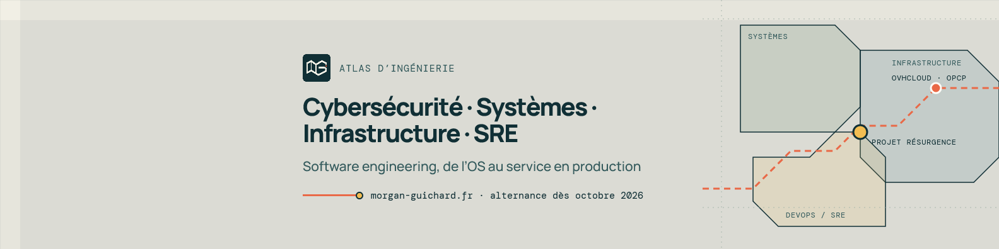

  

### Morgan Guichard · Atlas d’ingénierie

Étudiant à Epitech Montpellier. Je travaille sur toute la profondeur d’un système : Linux et infrastructure, automatisation et observabilité, sécurité défensive, puis le logiciel qui s’y exécute.

**Recherche une alternance à partir d’octobre 2026** en cybersécurité, systèmes, infrastructure ou SRE/DevOps.

| Repère | Contexte |
| :-- | :-- |
| **183** machines physiques | MCO et refactoring · SRE chez OVHcloud (OPCP) |
| **100+** endpoints REST | API Python · Projet Résurgence |
| **10+** services en production | Docker Compose, Nginx/TLS, PostgreSQL 16 |
| **Top 5** ×3 en CTF | Cycom CTF 2024 et 2025, GCC CTF 2024 |

#### Points remarquables

- **[Projet Résurgence](https://github.com/Projet-Resurgence)** : plateforme de jeu en ligne construite et exploitée en production depuis 2023. API REST, cinq interfaces reliées par SSO, authentification centralisée, bots et workers.
- **[PrivEscCord](https://github.com/AnnonyWOLFRODA/PrivEscCord)** : audit défensif en lecture seule de serveurs Discord, 11 contrôles classés par criticité.
- **[Extension VS Code](https://github.com/AnnonyWOLFRODA/COCRUTV)** : suivi des quotas Claude, Codex et OpenCode (TypeScript, JSON-RPC, SQLite).
- **[GCC CTF 2024](https://github.com/morgangch/GCC-CTF-2024)** : write-up, 5e place.

#### Outils du quotidien

`Linux` `Debian` `Bash` `Python` `Docker` `Nginx` `PostgreSQL` `WireGuard` `GitHub Actions` `OpenStack` `Netbox` `C` `C#`

[morgan-guichard.fr](https://morgan-guichard.fr/) · [LinkedIn](https://www.linkedin.com/in/morgan-guichard) · morgan.guichard@epitech.eu · 43.611° N / 3.877° E
